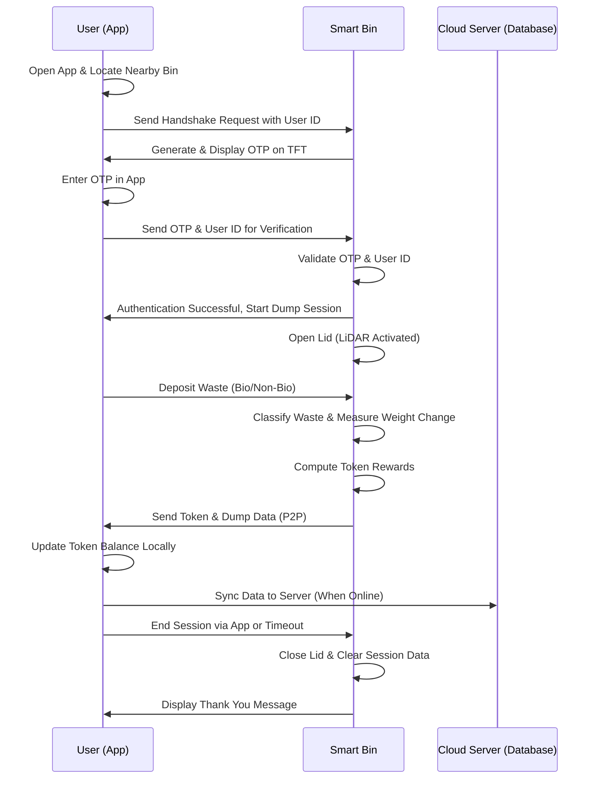

```mermaid
sequenceDiagram
    participant User as User (App)
    participant Bin as Smart Bin
    participant Cloud as Cloud Server (Database)

    %% Step 1: User opens app and locates bin
    User->>User: Open App & Locate Nearby Bin
    User->>Bin: Send Handshake Request with User ID
    
    %% Step 2: Bin authentication process
    Bin->>User: Generate & Display OTP on TFT
    User->>User: Enter OTP in App
    User->>Bin: Send OTP & User ID for Verification
    Bin->>Bin: Validate OTP & User ID
    Bin->>User: Authentication Successful, Start Dump Session
    
    %% Step 3: Garbage deposit & classification
    Bin->>Bin: Open Lid (LiDAR Activated)
    User->>Bin: Deposit Waste (Bio/Non-Bio)
    Bin->>Bin: Classify Waste & Measure Weight Change
    Bin->>Bin: Compute Token Rewards
    
    %% Step 4: Token transfer & session management
    Bin->>User: Send Token & Dump Data (P2P)
    User->>User: Update Token Balance Locally
    User->>Cloud: Sync Data to Server (When Online)
    
    %% Step 5: Session End & Clean-Up
    User->>Bin: End Session via App or Timeout
    Bin->>Bin: Close Lid & Clear Session Data
    Bin->>User: Display Thank You Message
```
