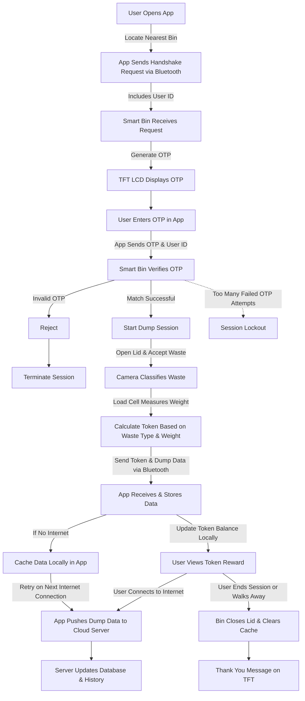

```mermaid
graph TD

    %% User Actions
    A[User Opens App] -->|Locate Nearest Bin| B[App Sends Handshake Request via Bluetooth]
    B -->|Includes User ID| C[Smart Bin Receives Request]
    
    %% OTP Authentication
    C -->|Generate OTP| D[TFT LCD Displays OTP]
    D --> E[User Enters OTP in App]
    E -->|App Sends OTP & User ID| F[Smart Bin Verifies OTP]
    
    %% Validation
    F -- Match Successful --> G[Start Dump Session]
    F -- Invalid OTP --> R[Reject] --> X[Terminate Session]

    %% Waste Classification & Token Calculation
    G -->|Open Lid & Accept Waste| H[Camera Classifies Waste]
    H -->|Load Cell Measures Weight| I[Calculate Token Based on Waste Type & Weight]
    
    %% Token Transfer
    I -->|Send Token & Dump Data via Bluetooth| J[App Receives & Stores Data]
    J -->|Update Token Balance Locally| K[User Views Token Reward]

    %% Cloud Sync
    K -->|User Connects to Internet| L[App Pushes Dump Data to Cloud Server]
    L --> M[Server Updates Database & History]
    
    %% Session Termination
    K -->|User Ends Session or Walks Away| N[Bin Closes Lid & Clears Cache]
    N --> O[Thank You Message on TFT]

    %% Loops & Security Measures
    F -.->|Too Many Failed OTP Attempts| Y[Session Lockout]
    J -->|If No Internet| P[Cache Data Locally in App]
    P -->|Retry on Next Internet Connection| L
```